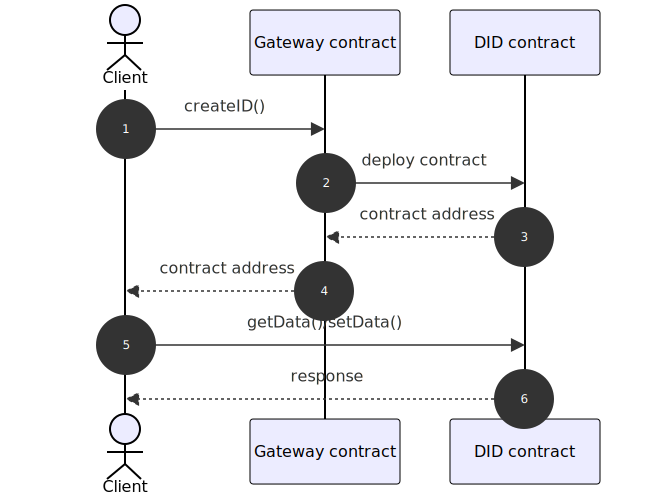

# Theseries DID Specification


## Introduction
DID provides a unique identification to protect the privacy of the sovereign identity for Theseries System


## Status Of this document
This is a draft document

## Target System
The target system is the Ethereum network where out contract is deployed. This could either be:

    Mainnet
    Sepolia
    other EVM-compliant blockchains such as private chains, side-chains, or consortium chains.

An example contract has been deployed to Sepolia testnet `0x47e6334374a7453B5fB22e37838E7B1d1e856BC4` for test purpose. 


## DID Method Definition
DID is the decentralization of user's digital identity, the namestring of this DID method is `theseries`.

## Method Specific Identifier
Method specific id is HEX-encoded ethereum address on the target network, the key pair is generated by DID SDK using HD wallet accounts.
```
did:theseries:<method-specific-id>
```

```
theseries-did = "did:theseries:" theseries-specific-identifier
theseries-specific-identifier = [ theseries-network ":" ] ethereum-address 
theseries-network = "mainnet" / "sepolia" / network-chain-id
network-chain-id = "0x" *HEXDIG
ethereum-address = "0x" 40*HEXDIG
```

Supports Ethereum "mainnet" and "sepolia" currently, can be extended by using network-chain-id in the future.

for example:
```
did:theseries:0xedc76A675c4e0e793a3Af2C307FB8dA09bFe3D11
did:theseries:0x1:0xedc76A675c4e0e793a3Af2C307FB8dA09bFe3D11
did:theseries:mainnet:0xedc76A675c4e0e793a3Af2C307FB8dA09bFe3D11
did:theseries:sepolia:0xedc76A675c4e0e793a3Af2C307FB8dA09bFe3D11
```


Algorithm support for key generation:
- Secp256k1
- more algorithms in the future

## DID Document Definition

Minimal DID Document example
```
{
  "@context":[
    "https://www.w3.org/ns/did/v1",
    "https://w3id.org/security/suites/secp256k1recovery-2020/v2"
  ],
  "id": "did:theseries:0xedc76A675c4e0e793a3Af2C307FB8dA09bFe3D11",
  "verificationMethod":[{
    "id": "did:theseries:0xedc76A675c4e0e793a3Af2C307FB8dA09bFe3D11",
    "controller": "did:theseries:0xedc76A675c4e0e793a3Af2C307FB8dA09bFe3D11",
    "type": "EcdsaSecp256k1RecoveryMethod2020",
    "blockchainAccountId":"eip155:1:0xedc76A675c4e0e793a3Af2C307FB8dA09bFe3D11"
  }],
  "authentication": [
    "did:theseries:0xedc76A675c4e0e793a3Af2C307FB8dA09bFe3D11#controller",
  ]
}
```


## Operations




### Creation
As users already have HD wallet accounts, just make use of them.
use first address of first account as method-specific-id.
e.g.
```solidity
function createID() public returns (address did) {}
```
calling createID() should create an ERC725 based smart contract and return contract address.
(TBD: ERC1056)

### Read (Resolve)
Client should cache ERC725 contract address.
```solidity
function getData(bytes32 dataKey) public view returns (bytes memory dataValue) {}
```
Call contract.getData() to fetch data of a given did to make DID Document.

for any reason client loses cached contract address invoke resolveID() to regain.
```
function resolveID(address owner) public view returns (address did) {}
```

### Update
Call contract.setData() to update DID data.
```solidity
function setData(dataKey, dataValue) public onlyOwner {}
```


### Delete(Revoke)
Owner can call revoke() to revoke DID.
```solidity
function revoke() public onlyOwner {}
```
Should update all data to empty and set owner to address 0x0.


## Security and Privacy considerations

DID document is signed using the users private key, any modification to the document requires a new signature.

User should manage private key (and mnemonic, passward of the wallet) locally and never expose to the public. losing these private key means losing control of DID and all VCs.

In theseries system, all users' private data is stored in local area. Only hash values or strings generated by crypt algorithms of the data are public on-chain, the attackers cannot derive the private data with the hash value or strings.

All data stored in DID documents is considered public. DID documents do not contain any personal information about the user concerned.


- Public Data: Since data is avaiable in public network, only hash values or content generated by crypto algorithms of the data are stored in DID document.

- Data Minimization: Ensure that only the necessary data is shared during DID transactions. The method should not expose private or sensitive information unless explicitly required by the user.

- Cryptographic Protection: Use strong encryption techniques for key management and DID operations, preventing unauthorized access to user data.

- Resistance to Phishing Attacks: Ensure that the method is resistant to phishing attacks by verifying signatures through secure, decentralized validation processes.

- Transaction Anonymity: Ensure that the DID method does not allow for linking DID transactions to specific users, maintaining privacy even when interacting with public blockchains.


## References

- https://www.w3.org/TR/did-core/

- [ERC725](https://github.com/ethereum/EIPs/issues/725)

- [EIP155](https://github.com/ethereum/EIPs/blob/master/EIPS/eip-155.md)
